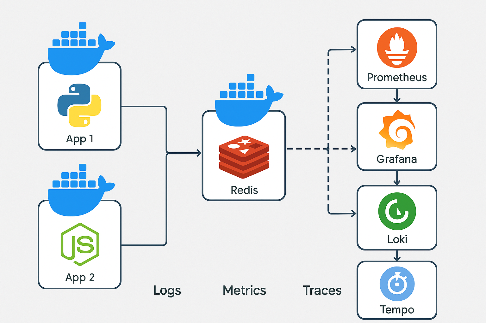

# Desafio DevOps 2025 - 

## Descrição

Este projeto é composto por dois microsserviços desenvolvidos em linguagens distintas (Python + FastAPI e Node.js + Express), utilizando Redis para cache, e com uma stack completa de Observabilidade (Logs, Métricas e Traces/Opentelemetry) provisionada automaticamente.

## Stack de Serviços

| Serviço     | Tecnologia                     | Função                     |
|--------------|-------------------------------|----------------------------|
| **App 1**    | Python + FastAPI               | API com cache de 10s       |
| **App 2**    | Node.js + Express              | API com cache de 60s       |
| **Redis**    | Redis 7                        | Cache                      |
| **Prometheus**| Prometheus                    | Coleta de Métricas         |
| **Grafana**  | Grafana                        | Dashboards                 |
| **Loki**     | Grafana Loki                   | Logs                       |
| **Tempo**    | Grafana Tempo                  | Traces distribuídos        |

---

## Diagrama da Arquitetura



---

## Executando o Projeto

### Pré-requisitos
- Docker
- Docker Compose

### Comandos para subir o ambiente:

```bash
docker-compose up -d